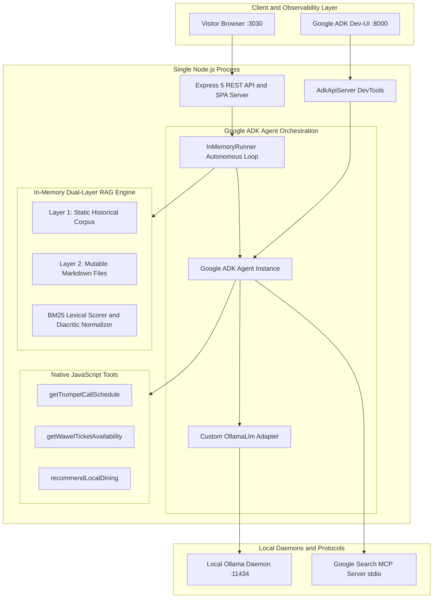
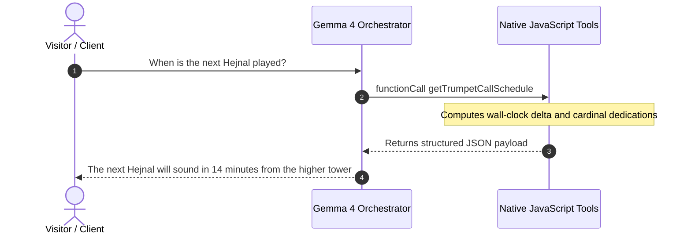
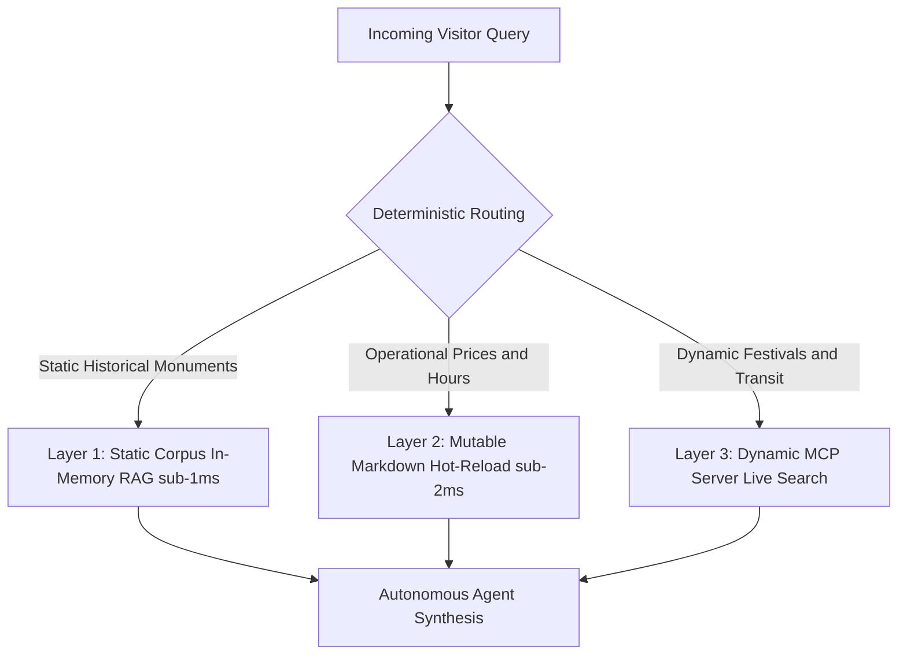

# Building a Local-First Cultural AI Assistant: Google ADK & Gemma 4 Masterclass

Welcome to the comprehensive technical guide for the **DevFest Kraków 2026 Masterclass**. In this hands-on workshop, we design and build a production-grade, local-first AI Tour Guide, Historian, and Concierge for the historic Royal Capital City of Kraków, Poland.

Rather than assembling fragile toy API wrappers or relying on heavy cloud services, this architecture runs **100% on-device** using modern Node.js LTS, Google's open-weights **Gemma 4** (orchestrated locally through Ollama), an ultra-lean **in-memory Dual-Layer RAG engine**, and the official **Google Agent Development Kit (`@google/adk`)**.


> [!NOTE]
> **Key Architectural Goal**: Build an autonomous AI agent system with zero external vector database bloat, sub-millisecond retrieval speeds, deterministic tool calling, zero cloud token bills, and seamless offline resilience.

---

## The AI Agent Paradigm Shift: Cloud vs. Local-First

When architects evaluate generative AI systems for physical venues—such as cultural landmarks, museums, and municipal kiosks—they often fall into the cloud anti-pattern. Examining how local-first engineering shifts these trade-offs highlights why on-device inference is so compelling:

| Dimension | The Cloud AI Anti-Pattern | The Local-First Modern Standard |
| :--- | :--- | :--- |
| **Operating Cost** | Metered per-token API bills that explode under heavy visitor traffic | **Zero API bills**: runs completely on local workstation or edge hardware |
| **Data Privacy** | User queries, chat logs, and telemetry are transmitted to third-party endpoints | **100% On-Device**: all text, embeddings, and telemetry remain on the machine |
| **Network & Latency** | 300ms–800ms roundtrip latency per hop; fails entirely without internet | **Sub-2ms retrieval**: local inference with sub-second token generation |
| **Infrastructure Stack** | Heavy Dockerized vector databases, Python microservices, and external daemons | **Lean Node.js ESM**: unified process with native in-memory retrieval |
| **Operational Updates** | Complex vector re-indexing pipelines, schema migrations, and sync jobs | **Zero-Downtime Hot Reload**: edit markdown on disk; live memory updates via `mtime` |

---

## System Architecture Blueprint

The entire application runs inside a single, unified Node.js process serving two dedicated ports concurrently. This unified model eliminates inter-process communication overhead, shared memory synchronization issues, and deployment complexity.



### Architectural Highlights

1. **Port 3030 — Express 5 REST API & SPA**: Serves a fast vanilla HTML5/CSS3 Single Page Application with zero frontend build tools (no Vite or Webpack bundling required). Provides conversational streaming endpoints (`POST /api/chat`), tool inspection, health telemetry, and live source attribution citations.
2. **Google ADK Orchestration**: Uses `@google/adk` to define typed `Agent`, `FunctionTool`, and `InMemoryRunner` instances, driven by our custom `OllamaLlm` adapter extending `BaseLlm`.
3. **Port 8000 — Official Google ADK Web Dev-UI**: Powered by `@google/adk-devtools`, exposing an interactive agent component graph explorer, step-by-step trace inspection, and live tool payload debugging.

---

## 6-Step Progressive Curriculum Roadmap

The workshop repository is structured into six self-contained, progressively complex milestones. Each directory features its own dependencies, source code, and automated tests executed using Node.js's native test runner (`node:test`):

| Step | Milestone | Tech Stack & Capabilities | Automated Tests |
| :---: | :--- | :--- | :---: |
| **01** | **Setup & Local LLM** | Ollama daemon, Gemma 4 via `OLLAMA_MODEL`, Node.js client | 5 tests |
| **02** | **Dual-Layer RAG Engine** | In-memory BM25, Polish diacritics, markdown chunking, `mtime` hot-reload | 9 tests |
| **03** | **Native Tool Binding** | JSON Schema declarations, Hejnał time math, Wawel ticket simulator | 7 tests |
| **04** | **Google ADK Orchestration** | `@google/adk`, `BaseLlm`, `FunctionTool`, `InMemoryRunner` tool loops | 23 tests |
| **05** | **Full Application & UI** | Unified Express SPA (:3030) + Google ADK Web Dev-UI (:8000) dual listener | 35 tests |
| **06** | **Google Search MCP** | Model Context Protocol stdio server, live search & dynamic cross-content | 42 tests |
| **TOTAL** | **All 6 Steps Combined** | **Full production local cultural concierge application** | **121 tests** |

```bash
# Global workspace navigation
git clone https://github.com/nuno-joao-andrade-dev/devfest-2026-krakow.git
cd devfest-2026-krakow

# Install all workspace dependencies
npm install

# Run all 121 tests across every milestone
npm test

# Launch the unified application
npm start
```

---

## Step 01: Setup & Local LLM Connectivity

The initial milestone establishes a robust, deterministic connection between Node.js and Google's Gemma model running on local hardware via Ollama.

### Prerequisites & Installation

#### 1. Node.js LTS via NVM
```bash
# Install Node Version Manager (NVM)
curl -o- https://raw.githubusercontent.com/nvm-sh/nvm/v0.40.1/install.sh | bash
source ~/.nvm/nvm.sh

# Install and activate Node.js 22 LTS
nvm install 22
nvm use 22
node -v   # v22.x.x
npm -v    # 10.x.x+
```

#### 2. Local Ollama Daemon & Model Weights
Install Ollama and pull the lightweight instruction-tuned **Gemma 4** weights:

```bash
# Linux
curl -fsSL https://ollama.com/install.sh | sh

# macOS
brew install ollama

# Start the Ollama daemon
ollama serve

# In a separate terminal, pull Gemma 4 (default ~1.8 GB)
ollama pull gemma4:e2b

# Optional fallback for resource-constrained laptops
ollama pull gemma2:2b
```

### Node.js Integration (`src/llm.js`)

In `src/llm.js`, we establish a resilient client interface. Notice that temperature is explicitly constrained to `0.2` to ensure high factual accuracy and prevent hallucinations regarding historical dates and monuments:

```javascript
import { Ollama } from 'ollama';

export const OLLAMA_HOST = process.env.OLLAMA_HOST || 'http://127.0.0.1:11434';
export const OLLAMA_MODEL = process.env.OLLAMA_MODEL || process.env.MODEL || 'gemma4:e2b';

export function createOllamaClient(host = OLLAMA_HOST) {
  return new Ollama({ host });
}

export async function checkOllamaHealth(client = createOllamaClient(), targetModel = OLLAMA_MODEL) {
  try {
    const res = await client.list();
    const names = res.models.map(m => m.name);
    return {
      online: true,
      modelFound: names.some(n => n.startsWith(targetModel) || targetModel.startsWith(n))
    };
  } catch (error) {
    return { online: false, modelFound: false, error: error.message };
  }
}

export async function queryGemma(prompt, opts = {}) {
  const client = opts.client || createOllamaClient();
  const model = opts.model || OLLAMA_MODEL;
  const start = Date.now();

  const res = await client.generate({
    model,
    prompt,
    stream: false,
    options: {
      temperature: 0.2 // Low temperature for grounded historical accuracy
    }
  });

  return {
    response: res.response.trim(),
    durationMs: Date.now() - start
  };
}
```

### Hands-On Verification
```bash
cd steps/step-01-setup-and-llm
cp .env.example .env
npm start
```

Expected output:
```text
Checking local Ollama connectivity at: http://127.0.0.1:11434
Target Model: gemma4:e2b
Ollama daemon is ONLINE.
Available models: gemma4:e2b
Model "gemma4:e2b" is ready locally!

Sending test query to Gemma 4: "Summarize Kraków in one short sentence."
Gemma 4 Response: Kraków is a historic Polish city renowned for its preserved medieval Old Town, royal Wawel Castle, and vibrant cultural heritage.
Duration: 1173ms
```

---

## Step 02: Dual-Layer In-Memory RAG Engine

A common architectural trap in AI engineering is assuming every Retrieval-Augmented Generation (RAG) system requires a vector database (such as Milvus, Pinecone, or Chroma). For venue-specific guides, museums, and local kiosks, domain knowledge usually consists of 50 to 500 paragraphs (< 2 MB of total text).

### Why Vector Databases are Overkill for Local Domain RAG

1. **Scale Mismatch**: Deploying a containerized database designed for billions of vectors to index 300 paragraphs introduces massive operational bloat.
2. **VRAM Cannibalization**: Loading a dense embedding model (e.g., `nomic-embed-text`) into memory consumes 1.5 GB of VRAM that the primary generative LLM desperately needs.
3. **Double Latency**: Generating query embeddings on CPU/GPU adds 50ms–200ms of unnecessary overhead before retrieval even begins.
4. **Semantic Drift on Keywords**: Dense vector embeddings frequently struggle with exact numbers, currency units ("35 PLN" vs. "55 PLN"), and specific room names. Lexical BM25 search guarantees exact keyword fidelity.

### The Dual-Layer Knowledge Model

```
+-------------------------------------------------------------------------+
|                       DualLocalRAGEngine (RAM)                          |
+-------------------------------------------------------------------------+
       |                                                 |
       v                                                 v
+-----------------------------+   +---------------------------------------+
|  Layer 1: Static Corpus     |   |  Layer 2: Mutable Markdown            |
|  (Compiled into Source)     |   |  (data/mutable/*.md)                  |
+-----------------------------+   +---------------------------------------+
| - Wawel Royal Hill History  |   | - wawel_pricing.md (Admission fees)   |
| - St. Mary's Basilica & Alt |   | - tourist_services.md (Helplines)     |
| - Cloth Hall (Sukiennice)   |   |                                       |
| - Kazimierz Jewish Quarter  |   | Zero-Downtime Hot Reload via          |
|                             |   | fs.statSync().mtimeMs invalidation    |
+-----------------------------+   +---------------------------------------+
                               |
                               v
+-------------------------------------------------------------------------+
| BM25 Lexical Scorer + Polish NFD Diacritics Normalization (ą, ć, ł → a, c, l) |
+-------------------------------------------------------------------------+
```

### Handling Polish Diacritics & Live Hot-Reloading

Searching Polish cultural texts requires handling special characters (`ą`, `ć`, `ę`, `ł`, `ń`, `ó`, `ś`, `ź`, `ż`). Visitors typing queries on English keyboards type "Wawel krakow kosciol Mariacki" without accents. 

Using Unicode Normalization Form KD (`NFD`), we strip combining diacritical marks while preserving the alphanumeric tokens:

```javascript
import fs from 'node:fs';

export function tokenize(text) {
  if (!text || typeof text !== 'string') return [];
  return text
    .toLowerCase()
    .normalize('NFD') // Decompose combined accents into base characters + mark
    .replace(/[\u0300-\u036f]/g, '') // Strip Unicode diacritical marks
    .replace(/[^\w\s]/g, ' ')
    .split(/\s+/)
    .filter(token => token.length > 2 && !STOP_WORDS.has(token));
}

// Sub-millisecond filesystem mtime invalidation cache
export class DualLocalRAGEngine {
  constructor(mutableDir) {
    this.mutableDir = mutableDir;
    this.cache = {}; // filename -> { mtime: number, chunks: Array }
  }

  getMutableChunks() {
    const chunks = [];
    const files = fs.readdirSync(this.mutableDir).filter(f => f.endsWith('.md'));

    for (const file of files) {
      const filePath = path.join(this.mutableDir, file);
      const stats = fs.statSync(filePath);

      // Cache Hit: served directly from RAM in microseconds
      if (this.cache[file]?.mtime === stats.mtimeMs) {
        chunks.push(...this.cache[file].chunks);
        continue;
      }

      // Cache Miss: re-chunk markdown heading blocks dynamically
      const content = fs.readFileSync(filePath, 'utf8');
      const freshChunks = chunkMarkdown(content, file);
      this.cache[file] = { mtime: stats.mtimeMs, chunks: freshChunks };
      chunks.push(...freshChunks);
    }

    return chunks;
  }
}
```

### Hands-On Lab: Zero-Downtime Hot Reload
1. Run tests in `steps/step-02-dual-layer-rag`:
   ```bash
   npm test
   # 9 tests pass in ~20ms
   ```
2. Open `data/mutable/wawel_pricing.md`.
3. Change the State Rooms ticket price from `35 PLN` to `55 PLN` and save the file.
4. Execute a query: the engine immediately scores and retrieves the updated `55 PLN` figure on the very next request—without restarting the Node.js process!

---

## Step 03: Native Tool Binding & Execution

Language models cannot reliably calculate modulo time arithmetic, know current wall-clock minutes, or read live museum ticket systems. Grounding the agent requires binding typed JavaScript functions directly into the execution loop.



### The Three Native Kraków Cultural Tools

1. **`getTrumpetCallSchedule`**: Calculates exact minutes remaining until the next hourly *Hejnał Mariacki* trumpet call from St. Mary's Basilica tower. It returns the four cardinal direction dedications:
   - **South**: For the King (Wawel direction)
   - **West**: For the City Mayor (Town Hall direction)
   - **North**: For the City Guards (Florian Gate direction)
   - **East**: For the Fire Brigade Chief (Poczta Główna direction)
   It also provides historical context on the legendary 1241 Mongol archer's arrow that cut the tune short.
2. **`getWawelTicketAvailability`**: Simulates real-time capacity and inventory across the Royal Private Apartments, Crown Treasury, and the Dragon's Den (*Smocza Jama*). Automatically enforces Kraków's traditional Monday free-admission policies.
3. **`recommendLocalDining`**: Curated dining recommendations filtered by neighborhood district (`Old Town`, `Kazimierz`, `Podgórze`) and budget tier (`budget` / `milk bar` such as *Bar Mleczny Górnik*, `moderate`, `fine dining` like *Bottiglieria 1881*).

### JSON Schema Declarations

Tools are declared using standard JSON Schema contracts so the model can inspect parameters, types, and descriptions to determine intent:

```javascript
export const toolDefinitions = [
  {
    type: 'function',
    function: {
      name: 'getWawelTicketAvailability',
      description: 'Check real-time ticket availability and remaining capacity for Wawel Royal Castle exhibitions.',
      parameters: {
        type: 'object',
        properties: {
          date: {
            type: 'string',
            description: 'Visit date in YYYY-MM-DD format. Defaults to today if omitted.'
          }
        },
        required: []
      }
    }
  }
];
```

---

## Step 04: Google ADK Agent Orchestration

In Step 04, we introduce the official **Google Agent Development Kit (`@google/adk`)**. Rather than writing brittle custom regex prompt parsers, ADK provides formal lifecycle primitives for agent state, tool wrapping, and conversation turns:

- **`Agent`**: Encapsulates instructions, registered tools, sub-agents, and model instances.
- **`BaseLlm`**: Abstract base class defining the `async *generateContentAsync()` generator protocol.
- **`FunctionTool`**: Formal wrapper validating input payloads against schema before invoking functions.
- **`InMemoryRunner`**: Coordinates multi-turn autonomous tool-execution loops.

### Custom Ollama Adapter (`OllamaLlm`)

To bridge Ollama's local chat API with Google ADK, we implement a custom subclass of `BaseLlm`:

```javascript
import { BaseLlm } from '@google/adk';
import { Ollama } from 'ollama';

export class OllamaLlm extends BaseLlm {
  constructor({
    model = process.env.OLLAMA_MODEL || process.env.MODEL || 'gemma4:e2b',
    host = process.env.OLLAMA_HOST || 'http://127.0.0.1:11434'
  } = {}) {
    super({ model });
    this.ollama = new Ollama({ host });
  }

  async *generateContentAsync(llmRequest, stream, abortSignal) {
    const messages = transformAdkContentsToOllama(llmRequest.contents);
    const tools = formatToolsForOllama(llmRequest.tools);

    const response = await this.ollama.chat({
      model: this.model,
      messages,
      tools,
      options: { temperature: 0.2 }
    });

    yield {
      content: {
        role: 'model',
        parts: response.message.tool_calls 
          ? response.message.tool_calls.map(tc => ({
              functionCall: {
                id: tc.id || `call_${Date.now()}`,
                name: tc.function.name,
                args: tc.function.arguments
              }
            }))
          : [{ text: response.message.content }]
      },
      finishReason: 'STOP',
      turnComplete: true
    };
  }
}
```

### Resilient Grounded Fallback Mode

> [!TIP]
> What happens if the Ollama daemon runs out of memory or crashes on a low-spec edge machine?
> 
> The architecture includes an automatic **Grounded RAG Direct Mode fallback**. If the LLM daemon fails health checks, the agent bypasses generation, runs local keyword extraction over the in-memory RAG index, directly executes matching domain tools, and produces a structured, grounded factual answer. The visitor kiosk stays online 100% of the time.

---

## Step 05: Unified Full Application & ADK Dev-UI

Step 05 unifies the entire stack into a production dual-port server (`src/server.js`):

```
+--------------------------------------------------------------------+
|                Single Node.js Process (src/server.js)              |
+--------------------------------------------------------------------+
        |                                            |
        v                                            v
+-----------------------------+            +-------------------------+
| Port 3030: Express 5 Server |            | Port 8000: ADK Dev-UI   |
+-----------------------------+            +-------------------------+
| - GET /                     |            | - Powered by            |
|   (Vanilla SPA frontend)    |            |   @google/adk-devtools  |
| - POST /api/chat            |            | - Visual Agent Graph    |
|   (Agent conversational API)|            | - Step Trace Inspector  |
| - GET /api/health           |            | - Live State Telemetry  |
|   (RAG & Ollama diagnostics)|            | - Compatible with       |
| - GET /api/tools            |            |   `npx adk web` CLI     |
+-----------------------------+            +-------------------------+
```

### Pure ESM Root Agent Export for ADK DevTools

To allow the official Google ADK Developer CLI (`npx adk web`) to automatically discover, inspect, and trace the agent graph, we export `rootAgent` from `krakow_cultural_agent/agent.js`:

```javascript
import { Agent } from '@google/adk';
import { OllamaLlm, getFunctionTools } from '../src/agent.js';

export const rootAgent = new Agent({
  name: 'krakow_cultural_agent',
  description: 'AI Tour Guide and Concierge for the Royal Capital City of Kraków',
  model: new OllamaLlm(),
  tools: getFunctionTools(),
  instruction: 'You are the official Kraków Cultural AI Tour Guide and Concierge...'
});
```

### Launching the Unified Service
```bash
cd steps/step-05-full-app
cp .env.example .env
npm start
```

Now explore the dual interfaces:
- **Kraków Concierge Web Application**: Open `http://localhost:3030` to chat with the assistant, trigger interactive chips, and observe live grounding badges.
- **Google ADK Web Dev-UI**: Open `http://localhost:8000/dev-ui` to inspect agent traces, view tool invocation payloads, and monitor latency in real time.

---

## Step 06: Model Context Protocol (MCP) & Google Search Server

### The Closed-World Problem in Local RAG

Local-first RAG and deterministic tools provide high-speed, cost-free historical facts. However, real-world visitors also ask dynamic questions:
- *"When does the Jewish Culture Festival take place in Kazimierz this summer?"*
- *"Where is Leonardo da Vinci's Lady with an Ermine currently exhibited in Kraków?"*
- *"What is the fastest public transit route from Kraków Airport (Balice) to Old Town?"*

Because static documentation and local markdown cannot predict seasonal festival schedules or transit changes, local AI suffers from a **closed-world limitation**.

### The Tri-Layer Knowledge Architecture

To solve this cleanly, we introduce the **Model Context Protocol (MCP)**, expanding our architecture into three distinct layers:



### Inside the Google Search MCP Server

Using `@modelcontextprotocol/sdk`, we spin up an isolated stdio child process server (`src/mcpServer.js`) that exposes two tools:
1. `google_search`: Real-time web queries via Google Custom Search API with a dynamic Kraków fallback provider.
2. `get_krakow_events_calendar`: Seasonal cultural calendar filtering across categories (`film`, `music`, `art`, `tradition`).

```javascript
import { Server } from '@modelcontextprotocol/sdk/server/index.js';
import { StdioServerTransport } from '@modelcontextprotocol/sdk/server/stdio.js';

const server = new Server(
  { name: 'google-search-mcp-server', version: '1.0.0' },
  { capabilities: { tools: {} } }
);

const transport = new StdioServerTransport();
await server.connect(transport);
```

### Binding MCP to Google ADK via `MCPToolset`

Google ADK provides first-class support for MCP via `MCPToolset`. The agent discovers the external tools over stdio and unifies them with native domain tools:

```javascript
import { Agent, MCPToolset } from '@google/adk';

// 1. Establish stdio connection parameters to the child process
const mcpToolset = new MCPToolset({
  type: 'StdioConnectionParams',
  serverParams: {
    command: process.execPath,
    args: ['./src/mcpServer.js']
  }
});

// 2. Discover MCP tools asynchronously
const mcpTools = await mcpToolset.getTools();

// 3. Register native tools and MCP tools side-by-side
const agent = new Agent({
  name: 'krakow_cultural_mcp_agent',
  model: new OllamaLlm(),
  instruction: systemPrompt,
  tools: [
    ...nativeTools, // Local function tools (Hejnał, Tickets, Dining)
    ...mcpTools     // MCP stdio tools (Google Search, Cultural Calendar)
  ]
});
```

Because `InMemoryRunner` treats `MCPTool` instances identically to native `FunctionTool`s, the multi-turn function calling loop works automatically with zero custom glue code!

---

## Instructor Troubleshooting & Common Traps

| Symptom / Error | Root Cause | Immediate Resolution |
| :--- | :--- | :--- |
| `ECONNREFUSED 127.0.0.1:11434` | Ollama daemon is not running | Run `ollama serve` in a background terminal. |
| `model 'gemma4:e2b' not found` | Model weights have not been downloaded | Run `ollama pull gemma4:e2b` or set `OLLAMA_MODEL=gemma2:2b`. |
| `EADDRINUSE: :::3030` | Previous server instance still occupies port 3030 | Run `lsof -ti:3030 \| xargs kill -9` or change `PORT` in `.env`. |
| `EADDRINUSE: :::8000` | Port 8000 collision on ADK Dev-UI | Set `ADK_PORT=8001` in your `.env` configuration. |
| Process Out of Memory (OOM) | System RAM constrained by large model context | Switch to the 2B parameter profile: `OLLAMA_MODEL=gemma2:2b`. |
| Participant stuck on code edit | Syntax typo in manual implementation | Attendees can immediately jump to the next `steps/step-0X/` directory. |

---

## Key Architectural Takeaways

1. **Local-First AI is Production-Ready**: Running Gemma 4 locally with Ollama provides complete data privacy, deterministic execution, and zero per-token operating expenses.
2. **Lean RAG Beats Vector DB Bloat**: For domain-specific applications, an in-memory lexical retrieval engine with diacritic normalization and `mtime` caching is faster (< 2ms), simpler, and more accurate than external vector databases.
3. **Official Frameworks Scale**: Combining **Google ADK** (`@google/adk`) for agent lifecycle management with **Model Context Protocol (MCP)** for external grounding delivers a clean, enterprise-grade architecture that passes all 121 automated tests in under 10 seconds.

---
### Special Thanks

* **[GDG Krakow](https://gdg.community.dev/gdg-krakow/)**

---

## Resources & Community Links

- **GitHub Repository**: [devfest-2026-krakow](https://github.com/nuno-joao-andrade-dev/devfest-2026-krakow)
- **Plumar Agent CLI (Local LLMs)**: [github.com/nuno-joao-andrade-dev/plumar](https://github.com/nuno-joao-andrade-dev/plumar)
- **Interactive Architecture Diagramming**: [DrawIt by NJA](https://drawit.nja.dev/)
- **Speaker Profile**: [Nuno Andrade on LinkedIn](https://www.linkedin.com/in/nuno-andrade-964b2416)
- **Google Agent Development Kit**: [`@google/adk` on npm](https://www.npmjs.com/package/@google/adk)
- **Google Open Models**: [ai.google.dev/gemma](https://ai.google.dev/gemma)
